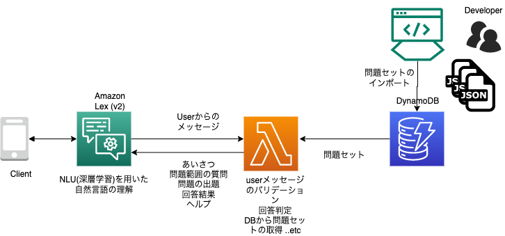

# 医師国試向けクイズボット（サンプル）

### ボットとの会話の流れ

- ユーザーが挨拶をするとボットはユーザーの名前を聞き返す
- 次にボットはユーザーが何を求めているか（Intent）を確認する
- ユーザーが「クイズを出して」などのように返答すると、ボットはクイズの出題範囲と問題数を質問する
- ユーザーからの回答により情報(slot)が集まると、ボットはユーザーへの確認(Confirm)後、決定(Fulfill)
- 条件に基づいた出題をDynamoDBから取得し、ユーザーへ出題
- 一問一答形式でユーザーはボットからの出題に回答する（画像問題、自由入力式、○✗ 式問題に対応）
- すべての問題に回答すると回答成績を表示し、終了。

### アーキテクチャ

